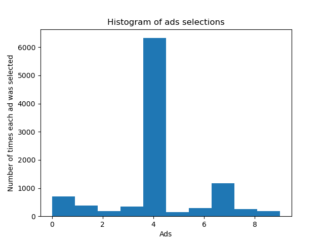

# Machine Learning Project

This project is focused on learning machine learning techniques and implementing them using Python.



## Overview

This Project focus on UPPER CONFIDENCE BOUND

## Table of Contents

- [Prerequisites](#prerequisites)
- [Getting Started](#getting-started)
- [Project Structure](#project-structure)
- [Usage](#usage)
- [Contributing](#contributing)
- [License](#license)

## Prerequisites

List the prerequisites that users need to have installed before they can use your project. Include links or instructions for installation.

Example:

- Python (version X.X.X)
- Jupyter Notebook or Anconda 
- NumPy (`pip install numpy`)
- Pandas (`pip install pandas`)
- Scikit-learn (`pip install scikit-learn`)

## Getting Started

1. Clone the repository:

    ```bash
    git clone https://github.com/grandpa90/upper_confidence_bound.git
    ```

2. Install dependencies:
    if applicable
    ```bash
    cd upper_confidence_bound
    pip install -r requirements.txt
    ```

3. Run the application:

    ```bash
    python upper_confidence_bound.py
    ```
